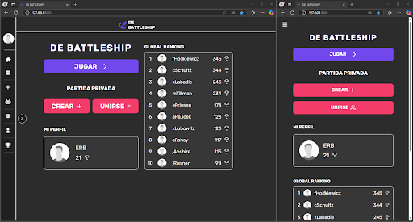
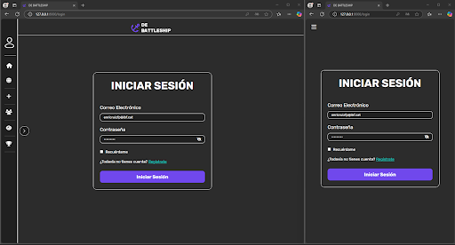
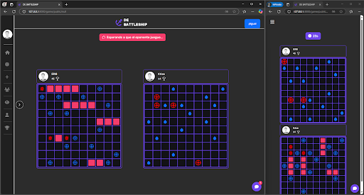
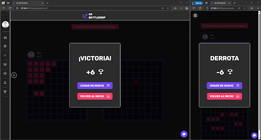
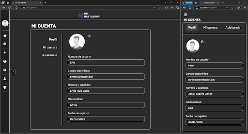
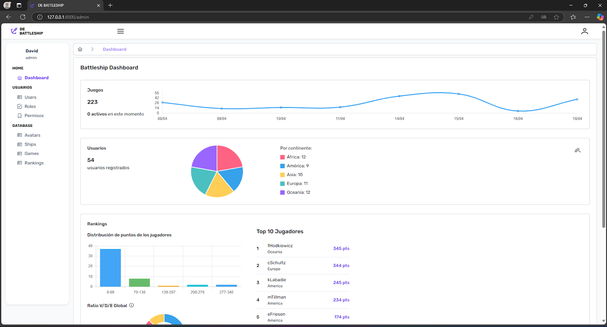

# 🧨 Hundir la Flota Online

¡El clásico de los barquitos, ahora online!
Desarrollado con Laravel 10 y Vue 3, el juego permite enfrentarte a tus amigos o jugadores aleatorios de cualquer parte del mundo. Incluye un chat en partida, ránkings globales y nacionales, sistema de autenticación y permisos y un panel de administración completo.

## 🚀 Demo

Aquí puedes observar el juego:








## 🛠️ Tecnologías usadas

| Categoría     | Tecnología              | Descripción                               |
| ------------- | ----------------------- | ----------------------------------------- |
| Backend       | Laravel 10              | Framework PHP moderno y robusto           |
|               | PHP 8.2+                | Lenguaje de programación backend          |
|               | Composer                | Gestor de dependencias para PHP           |
| Frontend      | Vue 3                   | Framework JavaScript progresivo           |
|               | Vue Router              | Sistema de rutas para Vue                 |
|               | Pinia                   | Gestión de estado para Vue                |
|               | PrimeVue                | Componentes UI listos para usar           |
|               | Vue i18n                | Soporte multi idioma                      |
|               | Bootstrap 5             | Framework de diseño responsivo            |
|               | Vite                    | Empaquetador rápido para frontend moderno |
| Autenticación | Laravel Breeze          | Sistema de auth simple y personalizable   |
|               | Verificación de email   | Activación segura de cuentas              |
|               | Recuperación de pass    | Restablecimiento mediante email           |
| Autorización  | Spatie Permissions      | Roles y permisos basados en middleware    |
| Base de datos | MySQL                   | Sistema de gestión de bases de datos      |
| Admin         | Panel de gestión        | CRUD de usuarios, roles, permisos y posts |
| Utilidades    | Chat en tiempo real     | Comunicación durante las partidas         |
|               | Ranking global/nacional | Clasificación por puntuación              |

## ✅ Requisitos

Se recomienda usar **[Laragon](https://laragon.org/)** para facilitar la instalación.

Asegúrate de tener instalado lo siguiente:

-   ✅ PHP 8.2 o superior → `php -v`
-   ✅ Composer → `composer -v`
-   ✅ Node.js → `node -v`
-   ✅ NPM → `npm -v`

## 📦 Instalación y uso

### Clonar Repositorio

```bash
git clone ....
```

### Instalar vía Composer

Entrar a la carpeta del repositorio

```bash
composer install
```

### Copiar el fichero .env.example a .env edita las credenciales de la base de datos y la url

### Generar Application Key

```bash
php artisan key:generate
```

### Migrar base de datos

```bash
php artisan migrate
```

### Lanzar Seeders

```bash
php artisan db:seed
```

### Instalar las dependencias de Node

```bash
npm install

npm run dev
```

### Lanzar servidor

```bash
php artisan serve
```

### Lanzar a producción

```bash
npm run build or yarn build
```

=======

# Proyecto2

Hundir la flota.

> > > > > > > 68f96d9c4acf28fd9e79e5425482f3b77c61d1bf

Integrar cambios realizados por el compañero:

```bash
git pull origin main
```

-   (main o rama deseada)

Crear link para poder acceder a las imágenes

```bash
php artisan storage:link
```

Comando para sembrar la base de datos

```bash
php artisan db:seed
```

Comando para refrescar la base de datos (eliminar todas las tablas, volver a migrarlas y luego ejecutar los seeders)

```bash
php artisan migrate:fresh --seed

```

## 🧑‍💻 Autores

Proyecto desarrollado por:

-   Daniel Lobera Simón
-   Enric Ruiz Badia

## 🔐 Credenciales

```bash
EMAIL                    PASSWORD    ROLE
admin@demo.com           12345678    Admin
danielloberafp@ibf.cat   Asdqwe!23   User
enricruizfp@ibf.cat      Asdqwe!23   User
```
